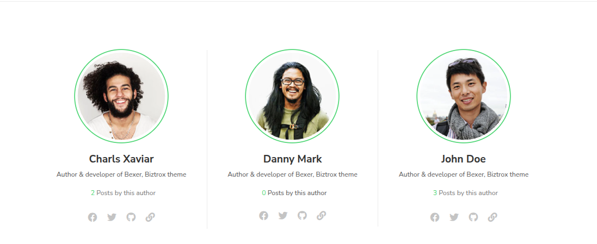

1. For now, don't make the database structure much complex. But in future, to add the functionality for users to add "Other Social Media" profiles in their accounts, you have to use a separate table for true 1‑to‑many flexibility, with the following structure:
- id, user_id, platform_name, url/username, timestamps
2. A page where users (either authenticated or non-authenticated) can see all the authors which have been a part of my blogging platform, or have written at least 1 post. Just like this:
